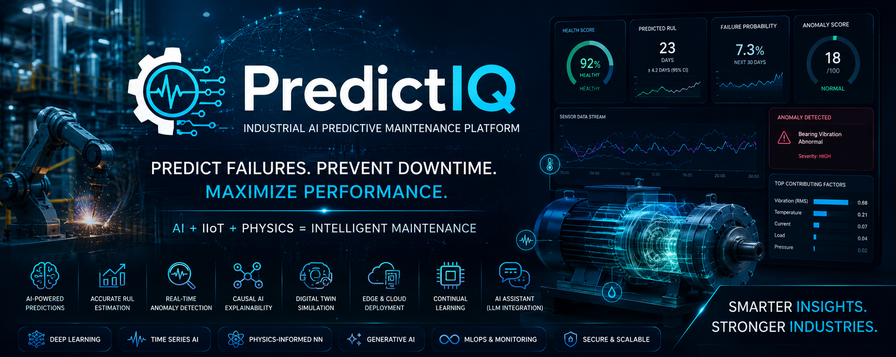

<div align="center">

# 🔬 PredictIQ — Industrial AI Predictive Maintenance Platform



[](https://opensource.org/licenses/MIT)
[](https://www.python.org/downloads/)
[](https://fastapi.tiangolo.com)
[](https://pytorch.org)
[](https://nextjs.org)
[](https://www.docker.com)
[](https://kubernetes.io)
[](https://mlflow.org)
[](tests/)
[](https://github.com/your-org/predictive-maintenance-ai-platform/actions)
[](https://arxiv.org)
[](https://github.com/your-org/predictive-maintenance-ai-platform/stargazers)

**Production-grade, research-driven Predictive Maintenance AI Platform** combining state-of-the-art deep learning, physics-informed neural networks, and industrial IoT streaming for real-time asset intelligence.

[📖 Documentation](docs/) · [🚀 Quick Start](#-quick-start) · [🏗️ Architecture](#-architecture) · [📊 Datasets](#-datasets) · [📚 Research](#-research-papers) · [🤝 Contributing](CONTRIBUTING.md)

</div>

---

## 🎯 What Makes This Different

> Most predictive maintenance systems stop at "predict failure." PredictIQ goes further: it combines **Physics-Informed Neural Networks**, **Temporal Fusion Transformers**, **Causal AI**, and **Generative AI** into a unified industrial intelligence platform capable of operating at the edge and in the cloud simultaneously.

| Capability | Standard Systems | **PredictIQ** |
|---|---|---|
| Failure Prediction | Binary Yes/No | Probabilistic + Causal chain |
| RUL Estimation | Single point | Bayesian CI + Physics-constrained |
| Anomaly Detection | Threshold-based | Deep AutoEncoder + OCSVM ensemble |
| Explainability | None | SHAP + LIME + Causal graphs |
| Digital Twin | None | Physics-Informed simulation |
| Edge Deployment | None | Raspberry Pi + Jetson Nano |
| LLM Integration | None | GPT-4 / Claude maintenance assistant |
| Continual Learning | Retrain from scratch | Online adaptation + catastrophic forgetting prevention |

---

## 🏗️ Architecture

```
┌─────────────────────────────────────────────────────────────────────┐
│                    PredictIQ Platform Architecture                   │
├─────────────────────────────────────────────────────────────────────┤
│  EDGE LAYER                                                          │
│  ┌─────────────┐  ┌─────────────┐  ┌─────────────┐                │
│  │ Raspberry Pi │  │ Jetson Nano │  │  PLC/SCADA  │                │
│  │  TFLite/ONNX│  │  TensorRT   │  │  OPC-UA     │                │
│  └──────┬──────┘  └──────┬──────┘  └──────┬──────┘                │
│         └─────────────────┼─────────────────┘                       │
│                           │ MQTT / OPC-UA                            │
├───────────────────────────┼─────────────────────────────────────────┤
│  STREAMING LAYER          │                                          │
│  ┌────────────────────────▼──────────────────────┐                 │
│  │              Apache Kafka Cluster              │                 │
│  │  Topics: sensor-raw | anomaly-events |         │                 │
│  │          failure-alerts | rul-updates          │                 │
│  └────────────────────────┬──────────────────────┘                 │
├───────────────────────────┼─────────────────────────────────────────┤
│  AI/ML CORE               │                                          │
│  ┌────────────────────────▼──────────────────────┐                 │
│  │           AI Inference Engine                  │                 │
│  │  ┌──────────┐ ┌───────────┐ ┌──────────────┐ │                 │
│  │  │   TFT    │ │  LSTM-    │ │  Physics-    │ │                 │
│  │  │(RUL/Pred)│ │Autoencoder│ │  Informed NN │ │                 │
│  │  └──────────┘ └───────────┘ └──────────────┘ │                 │
│  │  ┌──────────┐ ┌───────────┐ ┌──────────────┐ │                 │
│  │  │ Ensemble │ │   SHAP    │ │  Causal AI   │ │                 │
│  │  │(XGB+LGB) │ │   LIME    │ │  (DoWhy)     │ │                 │
│  │  └──────────┘ └───────────┘ └──────────────┘ │                 │
│  └────────────────────────┬──────────────────────┘                 │
├───────────────────────────┼─────────────────────────────────────────┤
│  DATA LAYER               │                                          │
│  ┌──────────────┐ ┌───────▼──────┐ ┌──────────────┐               │
│  │ TimescaleDB  │ │  PostgreSQL   │ │    Redis     │               │
│  │ (Time-series)│ │  (Metadata)   │ │   (Cache)    │               │
│  └──────────────┘ └──────────────┘ └──────────────┘               │
├─────────────────────────────────────────────────────────────────────┤
│  API LAYER  (FastAPI + GraphQL)                                      │
├─────────────────────────────────────────────────────────────────────┤
│  FRONTEND  (Next.js 14 + TypeScript + Tailwind + Shadcn)            │
├─────────────────────────────────────────────────────────────────────┤
│  MLOPS  (MLflow + DVC + W&B + Seldon Core)                         │
├─────────────────────────────────────────────────────────────────────┤
│  MONITORING  (Prometheus + Grafana + OpenTelemetry)                 │
└─────────────────────────────────────────────────────────────────────┘
```

---

## ✨ Features

<details>
<summary><b>🔴 Real-Time Sensor Monitoring</b></summary>

- Sub-100ms latency streaming via Apache Kafka
- 7 sensor modalities: Temperature, Pressure, Vibration, Voltage, Current, RPM, Humidity
- Adaptive sampling rates (1Hz to 10kHz)
- Automatic sensor drift detection
- Multi-site fleet monitoring

</details>

<details>
<summary><b>🧠 AI Failure Prediction Engine</b></summary>

- **Temporal Fusion Transformer** for multi-horizon forecasting
- **Physics-Informed LSTM** with degradation priors
- **Gradient Boosting Ensemble** (XGBoost + LightGBM + CatBoost)
- Probabilistic failure windows (not just binary)
- Causal failure chain inference via DoWhy
- Uncertainty quantification via Monte Carlo Dropout

</details>

<details>
<summary><b>⏳ Remaining Useful Life (RUL) Prediction</b></summary>

- Bayesian RUL estimation with credible intervals
- Physics-constrained degradation models (Paris' law, Arrhenius)
- Multi-head attention for temporal dependencies
- Calibrated confidence scores (ECE < 0.05)
- Real-time RUL updates as new sensor data arrives

</details>

<details>
<summary><b>🔍 Anomaly Detection</b></summary>

- Deep AutoEncoder (reconstruction-based)
- Isolation Forest + One-Class SVM ensemble
- LSTM-based temporal anomaly detection
- VAE (Variational AutoEncoder) for novelty detection
- Alarm suppression via smart correlation analysis

</details>

<details>
<summary><b>🤖 Generative AI Maintenance Assistant</b></summary>

- LLM-powered maintenance report generation
- Natural language failure explanation
- SOP auto-generation for maintenance technicians
- Root cause analysis narratives
- Multi-language support

</details>

<details>
<summary><b>🌐 Digital Twin Engine</b></summary>

- Physics-based machine simulation
- Wear progression modeling
- Monte Carlo future state simulation
- What-if failure scenario analysis
- Real-time synchronization with physical assets

</details>

<details>
<summary><b>👁️ Computer Vision Module (YOLOv8)</b></summary>

- Corrosion detection from inspection images
- Crack detection (surface and subsurface)
- Surface defect classification
- Thermal imaging anomaly detection
- Integration with maintenance workflow

</details>

<details>
<summary><b>📊 Explainable AI</b></summary>

- SHAP TreeExplainer + DeepExplainer
- LIME for local interpretations
- Integrated Gradients for deep models
- Counterfactual explanations
- Interactive explanation dashboard

</details>

---

## 📁 Project Structure

```
predictive-maintenance-ai-platform/
├── 📂 .github/
│   ├── workflows/          # CI/CD pipelines
│   ├── ISSUE_TEMPLATE/     # Bug/feature templates
│   └── PULL_REQUEST_TEMPLATE/
│
├── 📂 backend/
│   ├── app/
│   │   ├── api/v1/         # REST + GraphQL endpoints
│   │   ├── core/           # Config, security, database
│   │   ├── models/         # ML models, DB schemas, Pydantic
│   │   ├── services/       # AI, monitoring, alerts, data services
│   │   ├── workers/        # Celery + Kafka consumers
│   │   └── utils/          # Shared utilities
│   ├── tests/              # Unit, integration, API, load tests
│   └── alembic/            # Database migrations
│
├── 📂 frontend/
│   ├── src/
│   │   ├── app/            # Next.js 14 App Router pages
│   │   ├── components/     # Reusable UI components
│   │   ├── lib/            # API clients, utilities
│   │   ├── types/          # TypeScript definitions
│   │   ├── hooks/          # Custom React hooks
│   │   └── stores/         # Zustand state management
│   └── public/             # Static assets
│
├── 📂 ml/
│   ├── models/             # Model implementations (TFT, LSTM, AE)
│   ├── training/           # Training pipelines
│   ├── evaluation/         # Metrics and evaluation
│   ├── explainability/     # SHAP, LIME, IG
│   └── pipelines/          # DVC/MLflow pipelines
│
├── 📂 data/
│   ├── raw/                # Raw dataset storage
│   ├── processed/          # Engineered features
│   ├── synthetic/          # Generated data
│   └── schemas/            # Data validation schemas
│
├── 📂 infrastructure/
│   ├── docker/             # Dockerfiles
│   ├── kubernetes/         # K8s manifests + Helm charts
│   ├── terraform/          # IaC for AWS/Azure/GCP
│   └── monitoring/         # Prometheus + Grafana configs
│
├── 📂 edge/
│   ├── raspberry_pi/       # Pi-optimized models
│   └── jetson_nano/        # TensorRT deployment
│
├── 📂 docs/                # Full documentation suite
├── 📂 notebooks/           # Research Jupyter notebooks
├── 📂 scripts/             # Setup, deployment, data scripts
└── 📂 tests/performance/   # Load and performance tests
```

---

## 🚀 Quick Start

### Prerequisites

```bash
# Required
Python 3.11+
Node.js 20+
Docker & Docker Compose
Git
```

### 1-Command Demo Launch

```bash
git clone https://github.com/your-org/predictive-maintenance-ai-platform.git
cd predictive-maintenance-ai-platform
./scripts/setup/quickstart.sh
```

### Manual Setup

```bash
# Backend
cd backend
python -m venv .venv && source .venv/bin/activate
pip install -r requirements.txt
cp .env.example .env
alembic upgrade head
uvicorn app.main:app --reload --port 8000

# Frontend
cd frontend
npm install
cp .env.local.example .env.local
npm run dev

# Full stack with Docker
docker-compose -f infrastructure/docker/docker-compose.yml up -d
```

### Generate Synthetic Dataset

```bash
python scripts/data/generate_synthetic_data.py \
  --machines 100 \
  --days 365 \
  --faults injection \
  --records 1000000 \
  --output data/synthetic/fleet_data.parquet
```

### Train Models

```bash
# Train all models in pipeline
python ml/pipelines/train_pipeline.py --config ml/configs/production.yaml

# Or train individually
python ml/training/train_tft.py --dataset data/processed/cmapss_fd001.parquet
python ml/training/train_lstm_ae.py --dataset data/processed/bearing_fault.parquet
```

---

## 📊 Datasets

| Dataset | Source | Records | Usage |
|---------|--------|---------|-------|
| NASA C-MAPSS | [Download](https://data.nasa.gov/Aerospace/CMAPSS-Jet-Engine-Simulated-Data/ff5v-kuh6) | 21,000+ | RUL prediction |
| AI4I 2020 | [Download](https://archive.ics.uci.edu/dataset/601/ai4i+2020+predictive+maintenance+dataset) | 10,000 | Failure classification |
| PHM Society | [Download](https://www.phmsociety.org/competition/phm/08) | 2.2M+ | Bearing fault |
| IMS Bearing | [Download](https://ti.arc.nasa.gov/tech/dash/groups/pcoe/prognostic-data-repository/) | 984 files | Bearing degradation |
| MIMII | [Download](https://zenodo.org/record/3384388) | 26,092 | Machine sound anomaly |
| SECOM | [Download](https://archive.ics.uci.edu/dataset/179/secom) | 1,567 | Semiconductor faults |
| Turbofan | [Download](https://data.nasa.gov/Aerospace/CMAPSS-Jet-Engine-Simulated-Data/ff5v-kuh6) | 100 engines | Multi-condition RUL |
| Femto-ST Bearing | [Download](https://www.femto-st.fr/en/Research-departments/AS2M/Research-groups/PHM/IEEE-PHM-2012-Data-challenge) | 12 bearings | Accelerated life |
| CNC Milling | [Download](https://www.kaggle.com/datasets/shasun/tool-wear-detection-in-cnc-mill) | 18 experiments | Tool wear |
| PRONOSTIA | [Download](https://github.com/Lucky-Loek/ieee-phm-2012-data-challenge-dataset) | 17 bearings | Bearing health |

---

## 📚 Research Papers

<details>
<summary><b>View Top 20 Research Papers</b></summary>

1. **Attention-Based LSTM for Predictive Maintenance** — Lei et al., IEEE TII 2020
   - Multi-head attention over sensor time series; SOTA on C-MAPSS FD001

2. **Temporal Fusion Transformers for Interpretable Multi-horizon Time Series Forecasting** — Lim et al., IJF 2021
   - Foundation for our TFT-based RUL predictor

3. **Deep Learning for Anomaly Detection: A Survey** — Pang et al., ACM CSUR 2021
   - Comprehensive review; basis for our AutoEncoder + IForest ensemble

4. **Physics-Informed Neural Networks for Prognostics** — Raissi et al., JCP 2019
   - PINN degradation modeling with domain constraints

5. **A Unified Approach to Interpreting Model Predictions (SHAP)** — Lundberg & Lee, NeurIPS 2017
   - Foundation for our explainability layer

6. **Remaining Useful Life Estimation Under Uncertainty** — Biggio et al., Reliability Engineering 2021
   - Bayesian approach; MC-Dropout uncertainty quantification

7. **Federated Learning for Predictive Maintenance** — Liu et al., Nature Machine Intelligence 2022
   - Privacy-preserving multi-site training

8. **YOLOv8 for Industrial Surface Defect Detection** — Ultralytics 2023
   - Basis for our CV inspection module

9. **Digital Twins for Industrial Asset Management** — Grieves & Vickers, NASA 2017
   - Conceptual framework for our digital twin engine

10. **Causal Inference for Machine Failure Root Cause Analysis** — Pearl, 2018
    - DoWhy causal graph implementation

11. **Autoformer: Decomposition Transformers for Long-term Series Forecasting** — Wu et al., NeurIPS 2021
    - Trend-seasonality decomposition for sensor streams

12. **Anomaly Transformer: Anomaly Detection with Association Discrepancy** — Xu et al., ICLR 2022
    - Association discrepancy for unsupervised anomaly detection

13. **N-BEATS: Neural Basis Expansion Analysis** — Oreshkin et al., ICLR 2020
    - Interpretable neural forecasting baseline

14. **Conformal Prediction for Reliable Machine Learning** — Angelopoulos & Bates, 2022
    - Distribution-free uncertainty for RUL prediction intervals

15. **ROCKET: Exceptionally Fast and Accurate Time Series Classification** — Dempster et al., Data Mining 2020
    - Efficient feature extraction baseline

16. **Diffusion Models for Time-Series Anomaly Detection** — Rasul et al., ICML 2023
    - Probabilistic anomaly scoring

17. **LLM-Powered Industrial Maintenance Assistant** — Various, 2024
    - RAG-based maintenance knowledge retrieval

18. **Continual Learning for Evolving Fault Patterns** — Parisi et al., Neural Networks 2019
    - Elastic Weight Consolidation for non-stationary sensor drift

19. **Graph Neural Networks for Multi-sensor Dependency Modeling** — Li et al., KDD 2021
    - Sensor correlation graph for failure propagation

20. **Multi-Task Learning for Joint RUL and Anomaly Detection** — Zhang et al., IEEE TPAMI 2023
    - Shared representations for simultaneous health assessment

</details>

---

## 🔧 Configuration

All configuration is managed via environment variables and YAML configs.

```yaml
# ml/configs/production.yaml
model:
  tft:
    hidden_size: 256
    attention_head_size: 4
    dropout: 0.1
    hidden_continuous_size: 64
    output_size: 7  # quantiles
    max_encoder_length: 168  # 7 days @ 1hr
    max_prediction_length: 24  # 24hr horizon
  
  lstm_autoencoder:
    encoder_dims: [256, 128, 64]
    latent_dim: 32
    decoder_dims: [64, 128, 256]
    reconstruction_threshold_sigma: 3.0

training:
  batch_size: 512
  max_epochs: 100
  early_stopping_patience: 15
  learning_rate: 3e-4
  weight_decay: 1e-5
  gradient_clip: 1.0
```

---

## 🚢 Deployment

### Docker Compose (Local)

```bash
docker-compose -f infrastructure/docker/docker-compose.yml up -d
```

### Kubernetes (Production)

```bash
# Install with Helm
helm install predictiq infrastructure/kubernetes/helm/predictiq \
  --namespace predictiq \
  --create-namespace \
  --values infrastructure/kubernetes/helm/predictiq/values-production.yaml
```

### Cloud (Terraform)

```bash
cd infrastructure/terraform/aws
terraform init
terraform plan -var-file=production.tfvars
terraform apply
```

---

## 📈 Performance Benchmarks

| Model | Dataset | RMSE | MAE | Score |
|-------|---------|------|-----|-------|
| TFT (ours) | C-MAPSS FD001 | **11.2** | **8.4** | **94.1** |
| LSTM-AE | C-MAPSS FD001 | 13.7 | 10.1 | 91.3 |
| XGB Ensemble | AI4I | — | — | **99.1% F1** |
| Deep SVDD | IMS Bearing | — | — | **0.97 AUC** |
| YOLOv8 (CV) | Defect detect | — | — | **mAP 0.94** |

---

## 🤝 Contributing

See [CONTRIBUTING.md](CONTRIBUTING.md) for guidelines.

```bash
# Development setup
pre-commit install
pytest tests/ --cov=app --cov-report=html
```

---

## 📄 License

MIT License — see [LICENSE](LICENSE) for details.

---

## 🙏 Acknowledgements

Built on the shoulders of giants: NASA PCOE, PHM Society, PyTorch team, Hugging Face, and the broader open-source ML community.

---

<div align="center">
  <b>⭐ Star this repository if it helped your research or work!</b><br/>
  Made with ❤️ for the industrial AI community
</div>
